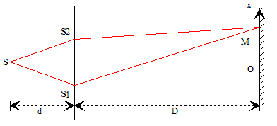
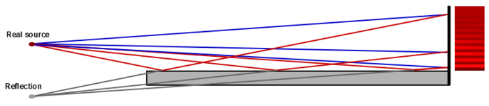
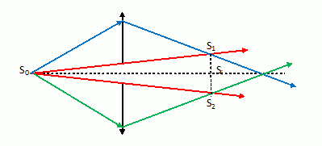
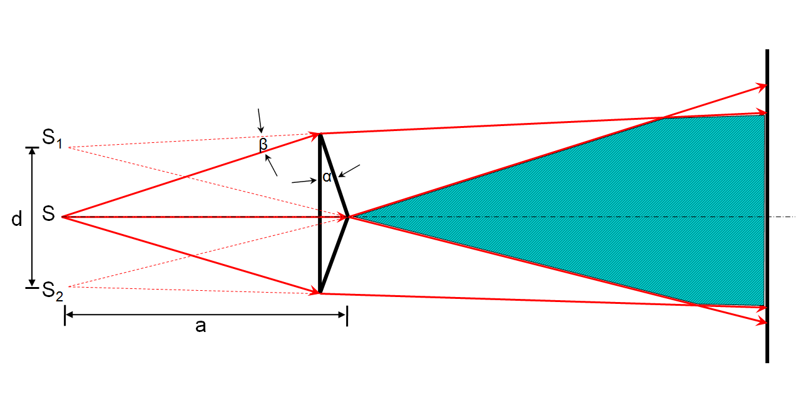
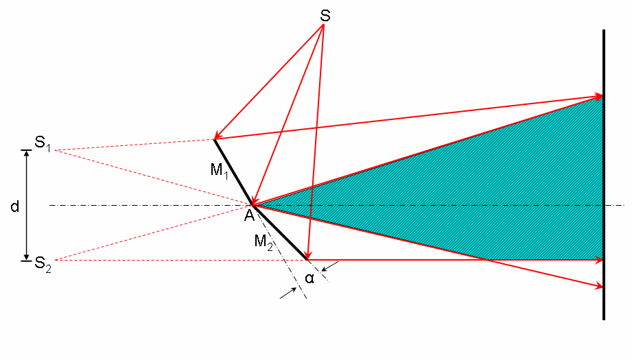

---
title : Interférence à deux ondes par division du front d'onde
author : Romain Gille
geometry : margin=1in
date : 09/03/2016
...

\newpage

# Interféromètres à division du front d'onde

Un dispositif interférenciel (ou interféromètre) est un appareil qui divise le 
faisceau lumineux provenant d'une source et fait se recouvrir dans une région de
l'espace les deux faisceaux issus de ce dédoublement après que ceux-ci aient
parcouru des chemins optiques différents.

## Trous d'Young

La source $S$ émet une onde sphérique. Les deux trous $S_1$ et $S_2$,
infiniment petits et percés dans un diaphragme isolent deux portions de l'onde
sphérique. $S_1$ et $S_2$ définissent ainsi deux sources ponctuelles
mutuellement cohérentes.

## Miroir de Lloyd

Les interférences s'effectuent dans la région commune au faisceau directement
émis par la source primaire $S_0$ et par le faisceau réfléchi en incidence
rasante par rapport au miroir. Par rapport à un système symétrique, la figure
d'interférence est décalée suivant $Ox$.

\newpage

## Bilentille de Billet

Les deux moitiés d'une lentille scindée symétriquement suivant un plan passant
par son axe optique et faiblement écartée l'une de l'autre par rapport à l'axe
forment de la source principale $S_0$ deux images réelles $S_1$ et $S_2$.

## Biprismes de Fresnel

Deux prismes de petits angles au sommet $A$ (quelques minutes d'angle) accolés
par leurs bases dévient la lumière issue d'une source $S$ d'un angle de
déviation $D = (n-1)A$. $D$ est indépendant de l'angle d'incidence sur chacun
des prismes

\newpage

## Miroirs de Fresnel

Deux miroirs inclinés, l'un par rapport à l'autre, d'un angle très petit
(quelques minutes d'angles) permet d'obtenir des sources virtuelles $S_1$ et
$S_2$ à partir d'une source primaire $S$.
Dans la partie de l'espace où se rencontrent les deux faisceaux issus de la
réflexion sur chacun des miroirs apparaissent des franges d'interférence
rectilignes et parallèles à l'arête commune aux deux miroirs.

\newpage

# Interférence par un dispositif symétrique à deux sources ponctuelles cohérentes

## Observation dans un plan parallèle à l'axe des sources

La plupart des dispositifs interférenciels à deux ondes par division du front
d'onde, notamment les dispositifs symétriques, permettent de traiter le
phénomène d'interférence de manière uniforme. En effet, pour tous ces
dispositifs nous considérerons deux sources ponctuelles cohérentes $S_1$ et
$S_2$ avec la même phase initiale.

Ainsi, il est possible de traiter le phénomène d'interférence en faisant
abstraction du dispositif expérimental. Dans le plan d'observation de la figure
d'interférence $\pi$ parallèle à ($S_1 S_2$) à la distance $D$ des sources,
les ondes sphériques issus de $S_1$ et $S_2$ distantes de $A$ sont assimilables
à des ondes planes.

Dans le repère $Oxyz$, le point $M$ dans la zone d'observation des interférence
est tel que $x \text{ et } y$ très inférieurs à $D$.

# Interférences par des fentes sources infinies

Si on déplace les sources secondaires $S_1 \text{ et } S_2$ par une translation
parallèle à $Oy$ au premier ordre, on ne change pas la différence de marche
$\delta$ entre les deux ondes. Ainsi, deux fentes sources parallèles peuvent
être considérées comme composées de couple de sources ponctuelles quand les
figures d'interférence se superposent exactement. Dans la pratique, cela sera
obtenu par l'emploi d'une fente source fine. Celle-ci n'a pas besoin d'être
spatialement cohérente dans sa longueur. L'intensité lumineuse en un point de la
figure d'interférence n'est alors que la somme des intensités engendrés par
chacun des couples de source ponctuelle interférant.

$$dI = \dfrac{2 I_0}{L_f}(1 + \cos{\phi})dy$$

Le contraste (ou visibilité) de la figure d'interférence est amélioré puisque
les franges brillantes ont une intensité lumineuse plus élevée.
L'intensité lumineuse par des fentes fines de longueur $L_f$ peut s'exprimer en
un point d'observation des interférences par :

$$I = \int\limits_{-L_f / 2}^{L_f / 2} 2 \dfrac{I_0}{L_f}(cos \phi + 1) dy$$
$$I = \int\limits_{-L_f / 2}^{L_f / 2} 2 \dfrac{I_0}{L_f}(cos(\dfrac{nxa}{D}
\times \dfrac{2\pi}{\lambda_0}) +1) dy$$
$$I = 2 \dfrac{I_0}{L_f}(cos(\dfrac{nxa}{D} \times \dfrac{2\pi}{\lambda_0})
+1)L_f$$
$$I = 2 I_0(cos(\dfrac{nxa}{D} \times \dfrac{2\pi}{\lambda_0}) +1)$$

\newpage

# Interférence par une fente source étendue

## Cohérence spatiale

Soit un point source $S$ de coordonnés $S(x, y, -D)$ d'une source étendue
$\Sigma$ dont sont issus deux ondes qui atteignent deux points sources
secondaires $S_1({a \over 2}, y_0, -D) \text{ et } S_2(-{a \over 2}, y_0, -D)$.  
La différence de marche entre les deux ondes au point $M(X, Y, 0)$,
point d'observation des interférences, est donc :

$$\delta = [S S_2 M] - [S S_1 M]$$
$$\delta = n(\overline{S S_2} + \overline{S_2 M}) -
           n(\overline{S S_1} + \overline{S_1 M})$$

$$\delta = n(\overline{S S_2} - \overline{S S_1}) +
           n(\overline{S_2 M} - \overline{S_1 M})$$

$$\delta = n(\overline{S S_2} - \overline{S S_1}) + \dfrac{n X a}{D}$$

$$\overline{S S_2} - \overline{S S_1} = \dfrac{\overline{S S_2}^2 -
\overline{S S_1}^2}{\overline{S S_2} + \overline{S S_1}}$$

$d$ est très supérieur à $a$ et la source $S$ reste proche du plan de symétrie
du diaphragme.

$$\overline{S S_2} + \overline{S S_1} \approx 2 d$$
$$\overline{S S_2}^2 = [(-{a \over 2} - x)^2 + (y - y_0)^2 + d^2]$$
$$\overline{S S_1}^2 = [({a \over 2} - x)^2 + (y - y_0)^2 + d^2]$$
$$\rightarrow \overline{S S_2}^2 - \overline{S S_1}^2 = 2 a x$$

$$I = \iint\limits_{\Sigma} 2 \dfrac{I_0}{\Sigma}
(1 + \cos({2 \pi^2 \delta \over \lambda_0}))dx dy$$

Avec $I_0$ l'intensité lumineuse émise par la fente, $\frac{I_0}{\Sigma}$
représentant donc la distribution spatiale de l'intensité lumineuse supposée
uniforme en tout points de la source.

$$I = 2 \dfrac{I_0}{\Sigma} \int\limits_{-L_f \over 2}^{L_f \over 2} dy
\int\limits_{-l_f \over 2}^{l_f \over 2} [1 + \cos(\dfrac{2 \pi}{\lambda_0}(
\dfrac{n a X}{D} + \dfrac{n a x}{d}))] dx$$

$$I = 2 \dfrac{I_0}{l_f}{[l_f + \dfrac{sin[\dfrac{2 \pi}{\lambda_0}
(\dfrac{n a X}{D} + \dfrac{n a x}{d})]}
{\dfrac{2 \pi}{\lambda_0} \dfrac{n a}{d}}]}_{-l_f \over 2}^{l_f \over 2}$$

\newpage

$$I = 2 \dfrac{I_0}{l_f}(l_f + [\sin[\dfrac{2 \pi}{\lambda}(\dfrac{a X}{D} +
\dfrac{a l_f}{2 d})] + \sin[\dfrac{2 \pi}{\lambda}(-\dfrac{a X}{D} +
\dfrac{a l_f}{2 d})]]\dfrac{d \lambda}{2 \pi a})$$

$$2 \sin a \cos b = \sin(a + b) + \sin(a - b)$$
$$I = 2 I_0(1 + \text{sinc}(\dfrac{\pi a l_f}{\lambda d})\cos({2 \pi}{\lambda}
\dfrac{a X}{D}))$$

Le sinus cardinal (sinc) est indépendant du point d'observation $M$, il s'agit
de la visibilité $V$.

$$V = \text{ sinc}(\dfrac{\pi a l_f}{\lambda d})$$

En effet, le terme $V \cos[\dfrac{2\pi}{ \lambda}\dfrac{a X}{D}]$ varie suivant
le point d'observation $M$ entre $|V| \text{ et } -|V|$, on a ainsi :

$$I_{max} = 2 I_0(1 + |V|)$$
$$I_{min} = 2 I_0(1 - |V|)$$

Le contraste $\gamma$ des franges d'interférences est donné par
$\dfrac{I_{\text{max}} - I_{\text{min}}}{I_{\text{max}} + I_{\text{min}}}$

Lorsque la largeur de fente $l_f$ tend vers $0$, la visibilité tends vers $1$.

On retrouve l'expression de l'intensité des franges d'interférence dans le cas
de la fente fine :

$$I = 2 I_0 (1 + \cos(\dfrac{2\pi}{\lambda}\dfrac{aX}{D}))$$

Quand la largeur de la fente source $l_f$ augmente depuis $0$, le contraste
diminue jusqu'à atteindre une valeur nulle pour
$$\dfrac{\pi a l_f}{\lambda d} = \pi$$

L'écran est alors uniformément éclairé (l'intensité est identique en tout point
$M$), autrement dit, la figure d'interférence disparaît. On parle alors de
brouillage des franges d'interférence.

On peut ainsi expliciter la largeur de cohérence spatiale $l_s$ présentée au
chapitre précédent comme étant dans le cas des fentes d'Young la largeur de
fente $l_f$ pour laquelle le contraste s'annule. 

On a :

$$l_s = \dfrac{\lambda d}{a}$$

\newpage

# Interférences par une source non monochromatique

## Cohérence temporelle

Pour l'intervalle de fréquence $d\nu$ l'onde monochromatique de fréquence $\nu$
et d'intensité $I_{\nu}(\nu) d\nu$ donne des interférences dont l'intensité au
point $M$ est :

$$dI = 2 I_{\nu}(\nu) d\nu(1 + \cos(\dfrac{2\pi}{\lambda_0}\delta))$$

Par analogie avec la formule vue pour une onde monochromatique, on pose

$$d I_0 = I_{\nu}(\nu)d\nu$$
$$I_0 = \int\limits_{\nu_1}^{\nu_2}I_{\nu}(\nu)d\nu
= I_{\nu}(\nu)(\nu_1 - \nu_2)$$

Avec $I_0$ l'intensité lumineuse totale de l'onde émise par la source.

Comme des ondes de fréquences différentes ne peuvent interférer, l'intensité en
un point $M$ est donc la somme des intensités créés par la somme des ondes
monochromatique de fréquence $\nu$ contenus dans la largeur de l'onde spectrale
$\Delta\nu$.

$$I = \int\limits_{\Delta\nu} dI = 2 \int\limits_{\nu_1}^{\nu_2}
\dfrac{I_0}{\nu_2 - \nu_1} (1 + \cos(\dfrac{2 \pi \delta}{\lambda_0}))d\nu$$

$$I = 2{(I_0 + \dfrac{\sin(\dfrac{2\pi\delta\nu}{c})}
{\dfrac{2\pi\delta}{c}})}_{\nu_2}^{\nu_1} \dfrac{I_0}{\Delta\nu}$$

$$I = 2(I_0 + \dfrac{c I_0}{2\pi\delta\Delta\nu}
[\sin(\dfrac{2\pi\nu_2\delta}{c}) - \sin(\dfrac{2\pi\nu_2\delta}{c})])$$

$$\sin p - \sin q = 2 \sin \dfrac{p  -q}{2} \cos \dfrac{p + q}{2}$$

$$I = 2 I_0(1 + \dfrac{c}{2\pi\delta\Delta\nu}\times
2 \sin(\dfrac{2\pi\delta\Delta\nu}{c}) \cos(\dfrac{2\pi\delta(\nu_1 + \nu_2)}{2c}))$$

$$I = 2 I_0(1 + \text{sinc}(\dfrac{\pi\delta\Delta\nu}{c})
\cos(\dfrac{2\pi\delta\nu_0}{c}))$$

\newpage

On obtient un nouveau facteur de visibilité $V$ qui cette fois dépend du point
$M$ car il dépend de la différence de marche $\delta$.
$\dfrac{1}{\Delta \nu}$ représente la durée moyenne des trains d'onde pour une
distribution spectrale rectangulaire. Il s'agit donc du temps de cohérence
$\tau_c$.

Le contraste $\gamma = |V|$ s'annule pour $\delta = \dfrac{c}{\Delta \nu}$,
donc pour $\delta = c \tau_c$.

$c \tau_c$ est la longueur de cohérence spatiale.

Or la longueur de cohérence temporelle $L_c$ est telle que $L_c = c \tau_c$ donc
$\delta = L_c$ lorsque le contraste s'annule.

La longueur de cohérence temporelle $L_c$ se définie ainsi comme étant la
longueur moyenne des trains d'onde pour laquelle le contraste s'annule.
On retrouve le fait que pour observer des interférences, on doit avoir
$\delta < L_c$ afin que les trains d'onde puissent se superposer au point $M$.
En effet, lorsque l'on trace la visibilité $V$ en fonction de $\delta$ la
visibilité devient négative pour $\delta > L_c$. Cela suggère une inversion du
système de frange qui n'a aucune réalité physique qui s'explique par le choix
d'une distribution spectrale simplifiée.

Ainsi, pour $\delta > L_c$, la figure d'interférence disparaît, l'éclairement
est uniforme, ce qui correspond à un contraste nul.
